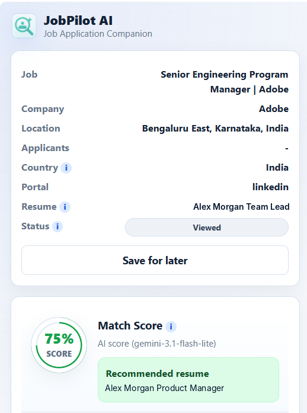
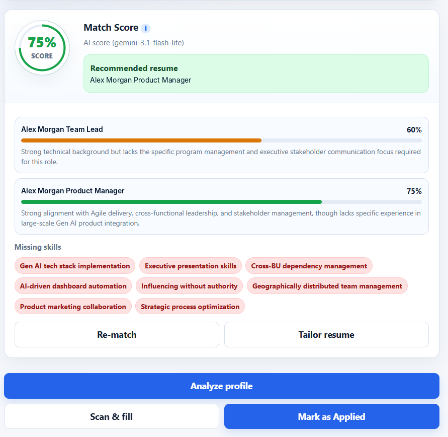
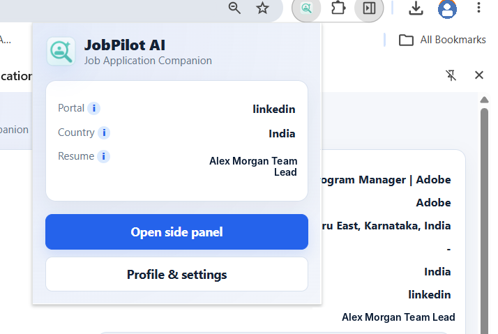
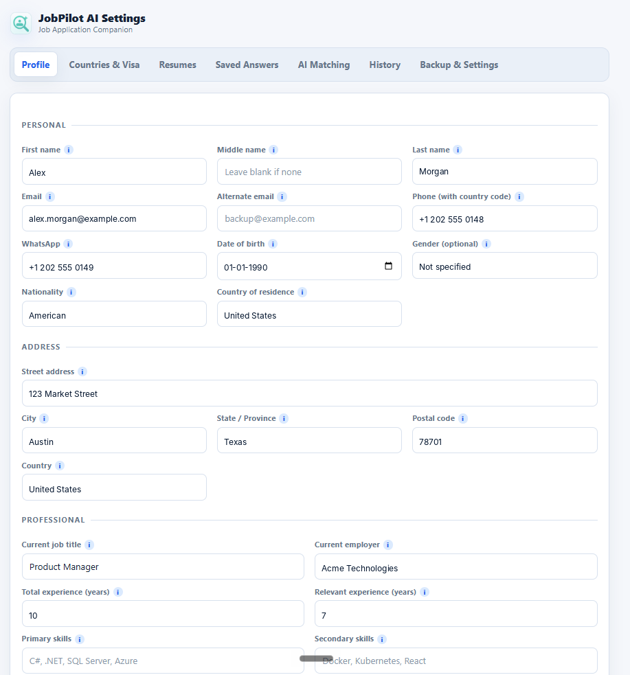
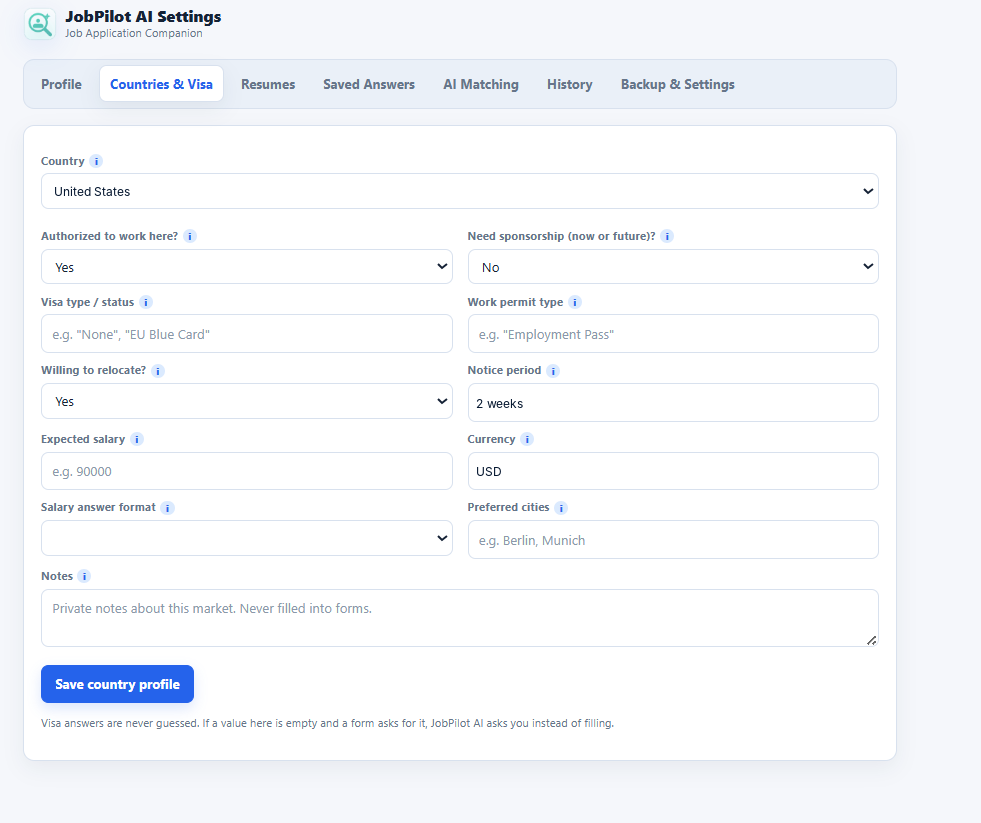
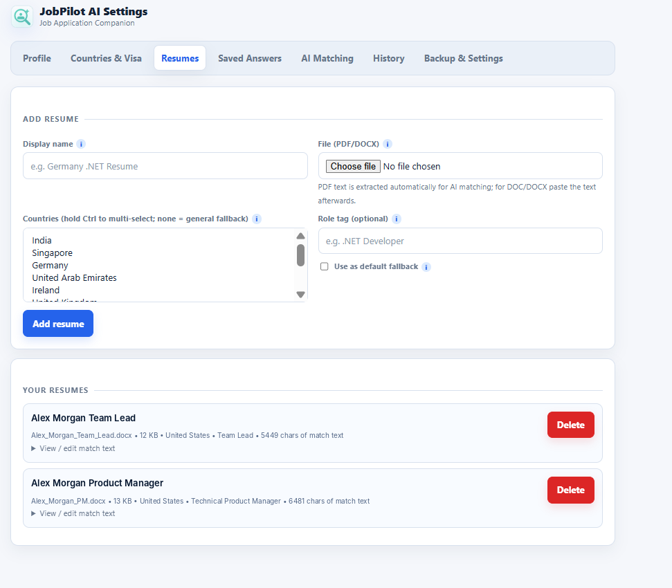
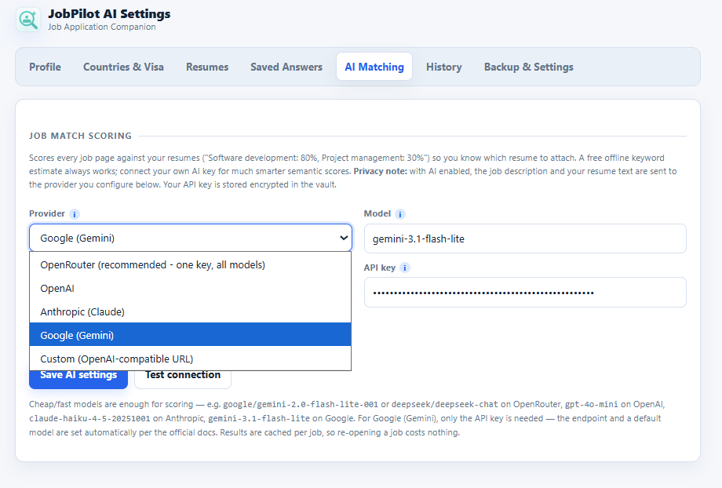
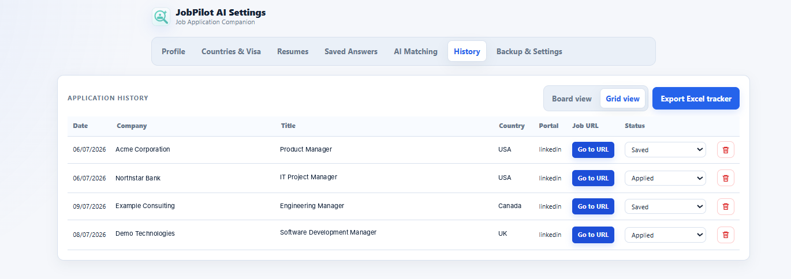
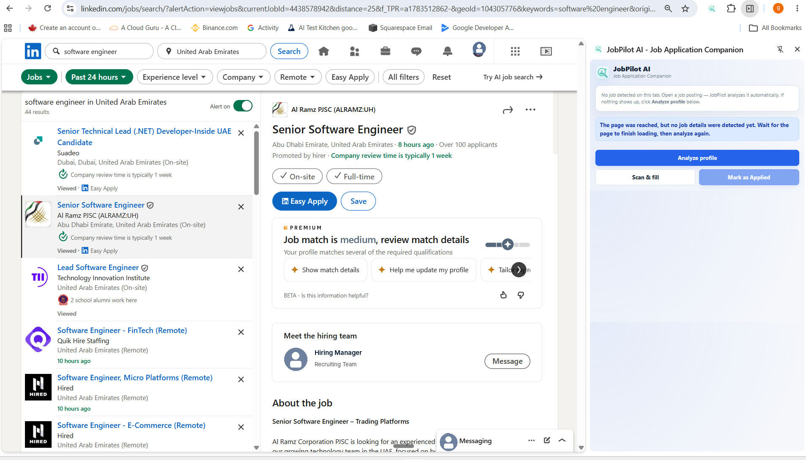

<p align="center">
  
</p>

# JobPilot AI

**Job Application Companion for Chrome**

JobPilot AI helps you move through job applications faster without giving up control. It reads the job page, detects the portal and country, chooses the best resume, fills safe known fields from your local profile, highlights anything that needs review, tracks the job in a Jira-style board, and can use your own AI key for job matching, resume tailoring, and answer drafting.

The extension is designed around one rule: **it assists, but it does not submit applications for you.**

## Screenshots

### Side panel — job details, country, portal, and recommended resume


### Side panel — match score, per-resume bars, missing skills


### Extension popup — quick status and side panel launcher


### Settings — profile


### Settings — countries and visa


### Settings — resumes


### Settings — AI matching provider


### Settings — application history (Jira-style board and grid view)


### LinkedIn side-panel view


## What It Does

### Application Assist

- Scans the current job page from the popup or side panel.
- Detects job title, company, location, country, portal, URL, and job description.
- Fills known form fields from your saved profile and country-specific answers.
- Attaches the selected resume when the portal allows programmatic upload.
- Highlights fields after filling:
  - Green: filled with high confidence.
  - Amber: filled, but worth reviewing.
  - Red: needs user input.
- Lists missing fields in the side panel so the user can answer them without hunting through the page.
- Lets users save answers by exact question, company, portal, country, or globally.
- Lets users dismiss a field if they prefer to handle it manually.
- Re-runs on the current page or next form step with **Scan & fill**.
- Handles login pages by pausing, letting the user log in manually, and resuming after login where possible.
- Detects CAPTCHA, OTP, and other safety stops.
- Never clicks **Next**, **Continue**, **Submit**, or any final application action.

### AI Job Matching

- Scores each detected job against your saved resumes.
- Shows an overall match percentage.
- Shows a per-resume match bar.
- Recommends the best resume for the job.
- Lists missing keywords and skills.
- Works with:
  - OpenRouter
  - OpenAI
  - Anthropic
  - Any OpenAI-compatible endpoint such as Groq, Together, or local Ollama
- Falls back to a free offline keyword estimate when AI is disabled.
- Supports automatic matching or manual matching from the side panel.
- Caches match results per job URL to reduce repeated AI calls.

### Resume Tailoring

- Generates resume-tailoring suggestions for the active job and selected resume.
- Shows a loader while AI tailoring is running.
- Shows keyword additions, bullet ideas, and practical notes.
- Lets the user collapse or expand the tailored summary in the side panel.
- Falls back to local keyword-based tailoring if AI is unavailable or fails.

### Draft Answers

- Drafts answers for safe text questions in the side panel.
- Uses AI when configured and local fallback when AI fails.
- Avoids drafting sensitive legal, visa, salary, demographic, or EEO answers.
- Inserts the draft into the side panel field so the user can review before filling.

### Resume and Profile Management

- Stores profile details such as name, contact, address, experience, education, links, skills, and cover letter text.
- Supports country-specific profiles for:
  - India
  - Singapore
  - Germany
  - UAE
  - Ireland
  - United Kingdom
  - Canada
  - United States
  - Australia
  - Netherlands
- Tracks country-specific visa, sponsorship, notice period, relocation, and salary answers.
- Supports multiple resumes mapped by country.
- Uses a default resume fallback when no country-specific resume matches.
- Extracts PDF text automatically for AI matching.
- Lets users paste or edit resume match text for DOC/DOCX or poor PDF extraction.

### Application History

- Saves job records locally with the job URL.
- Keeps **Viewed** internal so the history page stays focused on actionable jobs.
- Shows **Saved** jobs for roles the user wants to apply to later.
- Lets users manually move jobs through status stages:
  - Saved
  - Applied
  - Shortlisted
  - Interview Scheduled
  - Rejected
  - Offer
- Uses a Jira-style board as the default history view.
- Keeps the existing grid view available with a top view switcher.
- Updates the history page automatically when a job is saved, applied, or changed in another tab.
- Shows a high-contrast **Go to URL** link for each tracked job.
- Uses a red trash icon for deleting history records.
- Exports application history to Excel.

### LinkedIn Behavior

- Tracks and matches LinkedIn jobs.
- Keeps save-for-later and manual status tracking for LinkedIn.
- Fills known fields inside the LinkedIn **Easy Apply** modal on each step (contact details, work-experience blocks, and safe questions) using the same rules that apply to Greenhouse and Lever.
- Does not click **Next**, **Review**, or **Submit application** inside Easy Apply - the user always confirms each step manually.
- Does not auto-detect LinkedIn completion as applied.
- Requires the user to mark LinkedIn jobs as applied manually from the side panel or history page.
- Handles LinkedIn single-page navigation by detecting when the active job changes.

### Privacy and Safety

- Stores profile, resumes, answers, AI settings, and history locally.
- Keeps API keys encrypted in local extension storage.
- Sends data only to the AI provider the user explicitly configures.
- Sends only the job description and resume/profile text needed for matching or drafting.
- Does not use analytics.
- Does not use a hosted backend.
- Does not read Chrome saved passwords.
- Does not fill password fields.
- Does not bypass CAPTCHA, OTP, or portal security.
- Does not submit applications automatically.

## Supported Portals

Form filling is supported for:

- Greenhouse
- Lever
- Workday basic assist
- LinkedIn Easy Apply modal (step-by-step, without ever clicking Next / Submit)
- Generic company career pages

Read-only matching and tracking are supported for:

- LinkedIn Jobs (regular apply-off-site postings)

## Recommended UX Flow

1. Open a job page.
2. Click the JobPilot AI extension icon.
3. Click **Start Assist on this page**.
4. Review the side panel:
   - detected role
   - company
   - country
   - selected resume
   - match score
   - missing fields
5. Let JobPilot AI fill safe fields.
6. Answer missing fields from the side panel.
7. Review the actual job page.
8. Click the portal's own **Next**, **Continue**, or **Submit** button yourself.
9. Click **Mark as Applied** only after you have actually applied.
10. Track the job from the history board.

## Setup

### Requirements

| Requirement | Notes |
|---|---|
| Chrome 114+ | Chromium browsers such as Edge and Brave should also work |
| Node.js 18+ | Required to build the extension |
| npm | Installed with Node.js |

### Build

```bash
git clone https://github.com/gatikash/JobPilot-AI.git
cd JobPilot-AI
npm install
npm run build
```

The build output is created in `dist/`. Load that folder as the Chrome extension.

### Load In Chrome

1. Open `chrome://extensions`.
2. Enable **Developer mode**.
3. Click **Load unpacked**.
4. Select the `dist/` folder.
5. Pin JobPilot AI from the Chrome extensions menu.

## First-Time Configuration

Open the extension popup and click **Profile & settings**.

Configure these tabs:

- **Profile**: name, email, phone, address, links, experience, skills, education, and optional cover letter text.
- **Countries & Visa**: work authorization, sponsorship, notice period, salary, visa type, and relocation by country.
- **Resumes**: upload resumes, map them to countries, choose a default resume, and review extracted match text.
- **Saved Answers**: review answers collected while applying.
- **AI Matching**: connect OpenRouter, Google Gemini, OpenAI, Anthropic, or a custom OpenAI-compatible provider.
- **History**: track applications in board or grid view.
- **Backup & Settings**: export or import encrypted backups.

## AI Setup

OpenRouter is the easiest provider because one key can access many models.

Suggested low-cost model choices:

- `google/gemini-2.0-flash-lite-001`
- `gemini-3.1-flash-lite` on Google Gemini
- `deepseek/deepseek-chat`
- `gpt-4o-mini`
- `claude-haiku-4-5-20251001`

Steps:

1. Open **Settings > AI Matching**.
2. Pick a provider.
3. Paste your API key.
4. Choose a model.
5. Click **Test connection**.
6. Click **Save AI settings**.

Turn off **Match automatically** if you only want AI calls when you manually click **Match this job**.

## History Board

The history page defaults to board view because it is more useful for tracking applications over time.

Columns:

- Saved
- Applied
- Shortlisted
- Interview Scheduled
- Rejected
- Offer

Each card includes:

- job title
- company
- date
- portal
- country
- job URL
- status selector
- delete action

Grid view is still available from the top switcher for users who prefer table-style tracking.

## Backup and Export

- Export the history tracker as `.xlsx`.
- Export all extension data as a password-protected `.pja` backup.
- Restore the backup on the same or another Chrome profile using the password set during export.

## Updating

```bash
git pull
npm install
npm run build
```

Then open `chrome://extensions` and reload JobPilot AI.

## Troubleshooting

| Problem | Fix |
|---|---|
| Start Assist does nothing | Rebuild, reload the extension, refresh the job tab, then click **Start Assist on this page** again |
| Could not reach the page | The tab may be restricted or not an HTTP/HTTPS page; reload the job page and retry |
| No job details detected | Wait for the job page to finish rendering, then click **Scan & fill** |
| Fields fill and then disappear | The site's framework rejected the value; enter that field manually |
| Resume did not attach | Some portals block file injection; use the highlighted field and upload the shown resume manually |
| Country says Not detected | Country-specific answers are not auto-filled; answer those fields from the side panel |
| AI match failed | Check provider, base URL, API key, model name, and Chrome host permission |
| Popup asks for an old password | Complete the one-time migration from the popup |
| History does not update | Keep the history page open and reload the extension build; status changes should auto-refresh after the latest build |

## Development

```text
src/
  background/   MV3 service worker, routing, tracking, AI calls, status updates
  content/      page analyzer, field scanner, form filler, page signals
  lib/          IndexedDB, crypto, detectors, field matching, messages, tooltips
  popup/        main extension popup and assist trigger
  sidepanel/    live job assistant, match score, tailoring, missing-field Q&A
  options/      settings, profile, resumes, AI config, history, backups
```

Useful commands:

```bash
npm run typecheck
npm run build
npm run icons
```

## Security Model

- Extension data is stored locally in Chrome extension storage and IndexedDB.
- Sensitive config such as AI API keys is encrypted before storage.
- The content script cannot directly read the database or API keys.
- AI calls happen only when the user enables AI matching or explicitly triggers AI features.
- The extension has no server-side account, backend sync, telemetry, or analytics.
- The final application submission remains the user's responsibility.

## Disclaimer

JobPilot AI is a personal productivity tool. Always review every field before submitting an application. You are responsible for the accuracy of your application and for respecting each job portal's terms of service.
